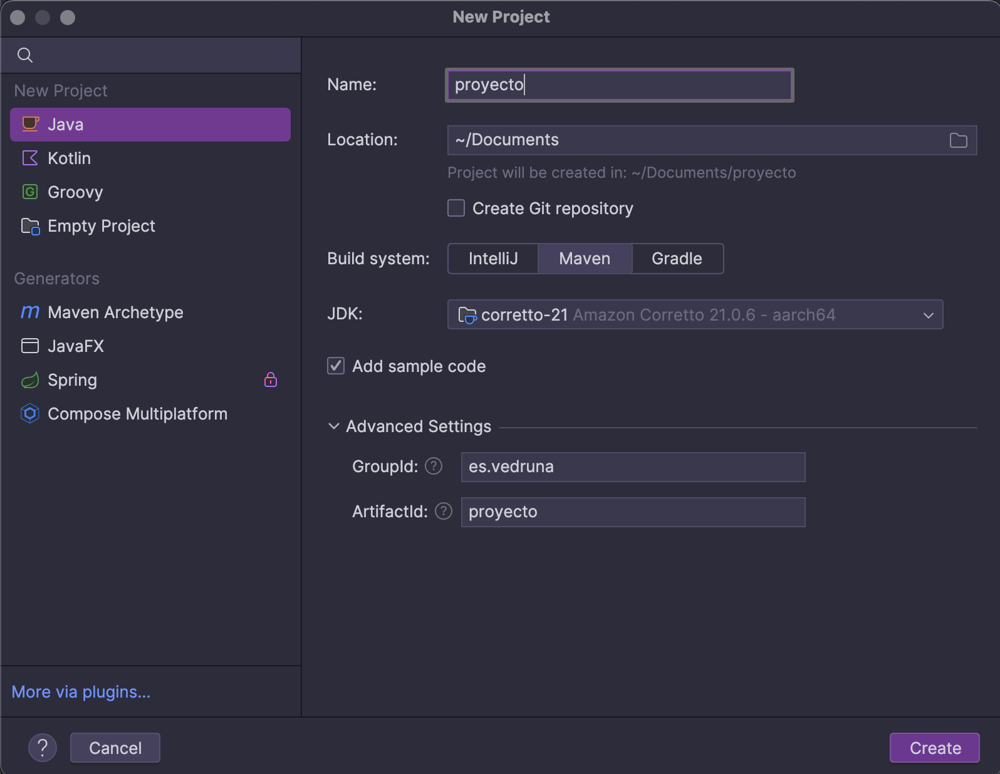

import { Steps } from '@astrojs/starlight/components';

En esta sección, aprenderemos a crear un proyecto Maven desde cero en IntelliJ IDEA.

## Crear un nuevo proyecto Maven

<Steps>

1. Una vez abierto IntelliJ IDEA, selecciona "New Project" en la pantalla de inicio.

2. Nos encontramos en la pantalla de selección de tipo de proyecto. Seleccionamos "Java" como hemos estado hasta ahora haciendo.
   

    - Pondremos el nombre del proyecto como `mi_proyecto`.
    - Seleccionaremos la ubicación del proyecto en nuestro sistema de archivos.
    - Podemos activar la opción de creación de repositorio Git si lo deseamos.
    - En `Build System`, seleccionamos `Maven`.
    - En `SDK`, seleccionamos la versión de Java que queremos usar (por ejemplo, Java 17).
    - Por último desplegamos la pestaña de `Advanved Settings` y rellenamos el `GroupId` como `es.vedruna` y el `ArtifactId` como `mi_proyecto`.
3. Hacemos clic en "Next" y ya tenemos nuestro proyecto creado. 

</Steps>

## Tarea

<Steps>

1. Crea un nuevo proyecto Maven en IntelliJ IDEA siguiendo los pasos anteriores.
2. Crea una clase que se llame `Vedruneitor`.
3. Dentro de esta clase, crea un método `Codificar` que reciba un `String` y devuelva un `String` codificado y otro método `Decodificar` que 
    reciba un `String` codificado y devuelva el `String` original.
4. Los métodos de `Codificar` y `Decodificar` deben tener una lógica para encriptar y desencriptar el texto. No uses librerías externas para esto.
    Crea tu propia lógica de encriptación y desencriptación.
5. En el método `main`, crea un menú que permita al usuario elegir entre codificar o decodificar un texto. Tras seleccionar la opción,
   pide al usuario que introduzca el texto y muestra el resultado en la consola.
6. Una vez que hayas terminado, genera los test de tu clase `Vedruneitor` y asegúrate de que todo funciona correctamente. Para ello, puedes usar JUnit 5.
7. Si todo funciona correctamente, sube el proyecto a tu repositorio de GitHub.

</Steps>